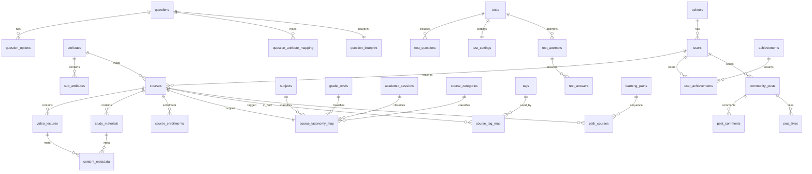

# EduquestIQ Backend Taxonomy and Relation Chart

This backend model uses practical LMS fields aligned with common K-12 interoperability references:
- IMS OneRoster (classes/courses/users/enrollments): https://www.imsglobal.org/oneroster-v11-final-specification
- Ed-Fi data model concepts (student/school/section/course taxonomy): https://docs.ed-fi.org/reference/data-exchange/data-standard/
- xAPI learning activity/event metadata patterns: https://xapi.com/statements-101/

## Taxonomy introduced
- `schools`
- `subjects`
- `grade_levels`
- `academic_sessions`
- `course_categories` (supports parent category)
- `tags` + `course_tag_map`
- `course_taxonomy_map` (links core taxonomy to course)
- `question_blueprint` (bloom level, competency, objective)
- `test_settings` (attempts/pass/availability/proctoring)
- `content_metadata` (visibility/language/version/license/tags)

## Relation chart

## Why these fields
- Course discoverability and governance: subject, grade, session, category, tags.
- Assessment quality: bloom level, competency code, learning objective, expected time.
- Assessment operations: pass mark, attempts, windows, proctoring mode.
- Content lifecycle and visibility: language, access level, version, license, tag metadata.
- Role-specific onboarding profile (`users.role_profile`) for parent/teacher/school admin fields.
